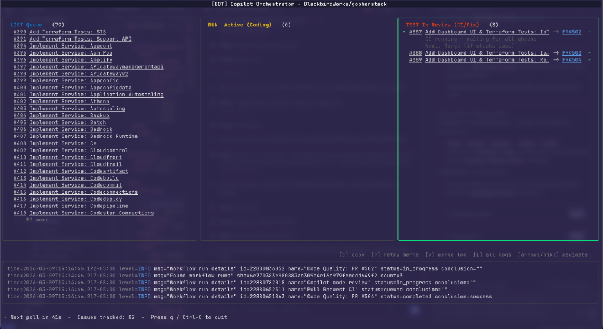
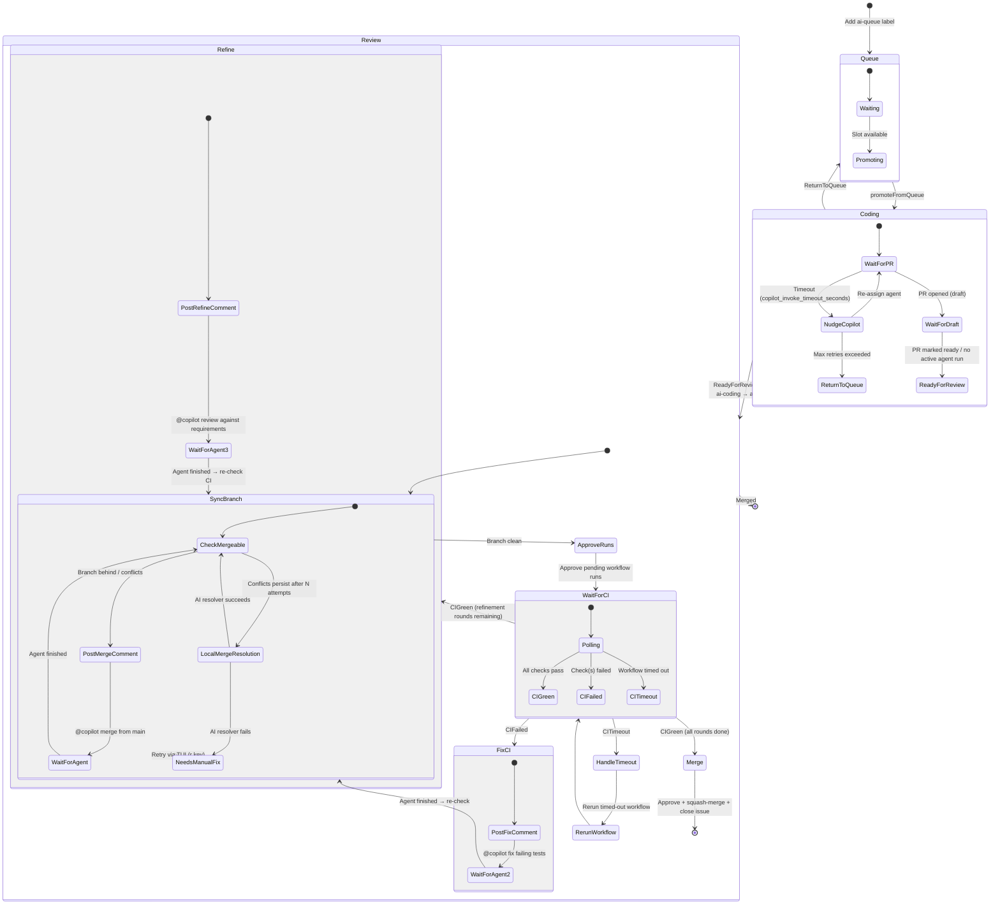

# copilot-autocode — Copilot Orchestrator TUI

A sophisticated, local Go Terminal UI (TUI) application that acts as a
headless **Copilot Orchestrator**.  It manages a large queue of GitHub issues,
feeds them sequentially to the native GitHub Copilot coding agent up to a
configurable concurrency limit, and babysits the resulting Pull Requests
through CI feedback and merging.



---

## Features

- **Three-column Bubble Tea dashboard** — Queue / Active (Coding) / In Review
- **State-machine poller** ticking every 45 s (configurable) using only GitHub
  labels, assignees, PR states, and workflow-run statuses as state storage
- **Automatic Queue → Coding promotion** honouring `max_concurrent_issues`
- **Automatic Copilot nudge** — if the Copilot coding agent does not open a PR
  within `copilot_invoke_timeout_seconds` (default 10 min) the orchestrator
  posts an @-mention comment and re-assigns the agent to re-trigger it; after
  `copilot_invoke_max_retries` failed nudges the issue is returned to the queue
  with an explanatory comment
- **Draft PR detection** — waits for Copilot to finish the initial coding pass
  before moving to review
- **Merge-conflict handling** — posts `@copilot Please merge from main…` and
  waits for the agent to finish before re-evaluating
- **Unlimited CI AutoFix** — whenever CI fails the orchestrator immediately
  posts `@copilot please fix the failing tests` with the failure logs attached;
  there is no cap on retries so it keeps going until CI is green
- **3-round issue-refinement gate** — once CI is green the orchestrator asks
  `@copilot` to review its implementation against the full original issue
  requirements **3 times** (waiting for the agent to finish and re-testing CI
  after each round) before finally approving and merging
- **Auto-approve & squash-merge** when all CI checks are green and the branch
  is up-to-date
- **Graceful Ctrl-C shutdown** without corrupting any state

---

## Prerequisites

| Requirement | Version |
|-------------|---------|
| Go          | ≥ 1.22  |
| GitHub PAT  | `repo` + `workflow` scopes |

The PAT must have permission to:
- Read and write issues (labels, assignees, comments)
- Read and write pull requests (reviews, merges)
- Read Actions workflow runs and logs

---

## Installation

```bash
git clone https://github.com/BlackbirdWorks/copilot-autocode.git
cd copilot-autocode
go build -o copilot-autocode .
```

---

## Configuration

1. Copy the example config:
   ```bash
   cp config.yaml.example config.yaml
   ```

2. Edit `config.yaml`:
   ```yaml
   github_owner: "my-org"
   github_repo:  "my-repo"
   max_concurrent_issues: 3
   poll_interval_seconds: 45
   ```

---

## Usage

```bash
export GITHUB_TOKEN="ghp_…"
./copilot-autocode --config config.yaml
```

Press **q** or **Ctrl-C** to quit gracefully.

---

## Workflow Labels

The orchestrator uses three GitHub labels to track issue state.  They are
created automatically the first time the app runs if they don't already exist.

| Label       | Colour  | Meaning                                           |
|-------------|---------|---------------------------------------------------|
| `ai-queue`  | blue    | Issue is waiting to be handed to Copilot          |
| `ai-coding` | yellow  | Copilot is currently writing code for this issue  |
| `ai-review` | orange  | PR open; waiting for CI / merge                   |

To enqueue an issue, simply add the `ai-queue` label to it.

---

## Architecture

```
main.go
 ├── config/config.go         – YAML config loader
 ├── ghclient/client.go       – go-github wrapper (all GitHub API calls)
 ├── poller/
 │   ├── poller.go            – state machine + command channel (background goroutine)
 │   └── task.go              – per-PR pipeline (sync → CI → fix → refine → merge)
 ├── resolver/resolver.go     – local merge-conflict resolution via AI CLI
 ├── pkgs/
 │   ├── logger/              – context-aware slog helpers
 │   └── rotatinglog/         – size-based rotating log file writer
 └── tui/
     ├── model.go             – Bubble Tea model, Update/View, log viewer overlay
     └── style.go             – lipgloss styles
```

### State Machine



#### Legend

| State | Description |
|-------|-------------|
| **Queue** | Issue labelled `ai-queue`, waiting for a concurrency slot |
| **Coding** | Copilot agent is writing code; orchestrator nudges if it stalls |
| **Review** | PR open — sync branch, run CI, fix failures, refine, then merge |
| **LocalMergeResolution** | Configurable AI CLI (e.g. Gemini) resolves merge conflicts locally |
| **FixCI** | Posts `@copilot fix …` with failure logs; unlimited retries |
| **Refine** | Posts `@copilot review …` against original requirements (3 rounds) |

---

## Roadmap

1. **Desktop notifications** — Native OS notifications (via `beeep` or similar)
   when PRs merge, agents time out, or merge conflicts need manual intervention.
   Keeps you informed without watching the TUI full-time.

2. **Issue detail pane** — Press `Enter` on a selected item to expand a detail
   panel showing PR description, per-workflow CI status, refinement history,
   and the full comment timeline.

3. **Manual takeover from TUI** — Press `t` to add a `manual-takeover` label
   that pauses the orchestrator for that issue, letting a human step in
   without fighting the bot.

4. **Force re-run CI from TUI** — Press `f` to re-run failed or stale
   workflows directly from the dashboard (wired to the existing
   `RerunWorkflow` method).

5. **Priority reordering** — Press `+`/`-` to bump issues up or down in
   the queue column, controlling which issues get promoted first.

6. **Activity feed / timeline** — A per-item event timeline built from
   comment timestamps, showing every orchestrator action (nudge, fix,
   refine, merge attempt) with relative timestamps.

---

## License

[MIT](LICENSE)
